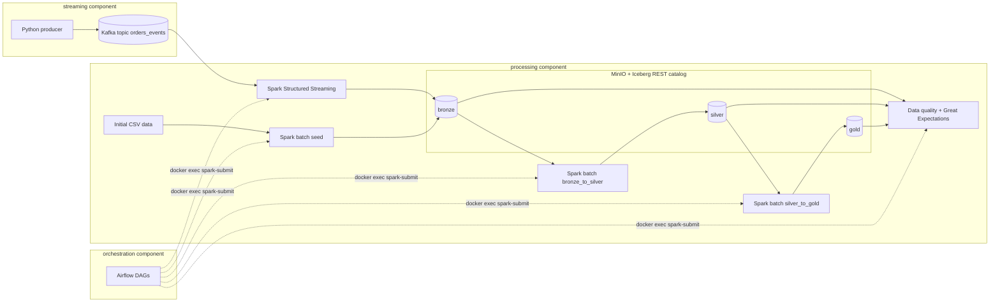

# Project Plan — Data Engineering Final Project

Domain: **e-commerce order analytics** (batch order history + real-time order-status events).
Assumption: the mid-semester project files were not provided, so the dimensional model is
designed fresh for this domain and documented in `docs/data_model.md`. Initial data is
generated (explicitly allowed by the assignment: "Initial data (can be generated)").

## Requirements checklist (from "Data Engineering Final Project.pdf" + "Evaluation criteria.pdf")

Status legend: [x] DONE (verified end-to-end locally on 2026-07-20)

### Required technologies
- [x] R1. Apache Iceberg table format — all 14 tables `USING iceberg` via REST catalog (`processing/jobs/spark_config.py`)
- [x] R2. MinIO bronze/silver/gold — bucket `warehouse`, namespaces created in `spark_config.py::ensure_namespaces`
- [x] R3. Spark batch — `seed_bronze.py`, `bronze_to_silver.py`, `silver_to_gold.py` (verified: 5594+ orders through all layers)
- [x] R4. Spark streaming — `streaming_ingest.py` (verified: 1969+ events ingested, 30s micro-batches)
- [x] R5. Kafka real-time source — `streaming/docker-compose.yml`, topic `orders_events`, KRaft mode
- [x] R6. Python producer — `streaming/producer/producer.py` (verified: ~60 events/min with late-event simulation)
- [x] R7. Airflow orchestration — `orchestration/dags/` (verified: scheduled + manual runs, all green)
- [x] R8. mermaid.js data models — `docs/data_model.md` (3 ERDs), `docs/architecture.md`
- [x] R9. Data quality checks — `data_quality.py` (21 checks; verified: ERROR gate blocks, WARN reports)
- [x] R10. Docs + simple docker setup — `README.md` quick start = 4 commands
- [x] R11. No Hive, no HDFS — Iceberg REST catalog + MinIO S3 only

### Project structure
- [x] S1. `/orchestration` — Airflow (webserver, scheduler, postgres, init)
- [x] S2. `/streaming` — Kafka, kafka-init, producer
- [x] S3. `/processing` — MinIO, Iceberg REST, spark-master + all Spark jobs
- [x] S4. `README.md` at root with local run instructions
- [x] S5. `docs/` — architecture, data model, data quality, components
- [x] S6. Three Docker Compose files, one per component
- [x] S7. Shared external network `lakehouse` joins all three stacks
- [x] S8. Spark runs ONLY in `spark-master` (processing) — Airflow submits via `docker exec`, verified in task logs

### Implementation requirements
- [x] I1. Batch source — 4 generated CSVs → `bronze.customers_raw/products_raw/orders_raw` (verified: 500/100/5001 rows)
- [x] I2. Streaming source — producer → Kafka → `bronze.order_events` (verified end-to-end)
- [x] I3. Late-arriving data — 48h rule in `bronze_to_silver.py::split_events_by_lateness`; late ≤48h merged out of order, >48h quarantined (verified: 112 rows in `silver.order_events_rejected`)
- [x] I4. Batch ETL bronze→silver→gold — MERGE-based, idempotent (verified: 2 full DAG runs)
- [x] I5. Stream processing — JSON parse, schema enforcement, exactly-once Iceberg appends (checkpointed)
- [x] I6. DQ at multiple stages — `dq_bronze`, `dq_silver`, `dq_gold` tasks + audit trail (verified: 42 results in `audit.dq_results`)
- [x] I7. Fact + dimension tables — `gold.fact_orders`, `dim_customer`, `dim_product`, `dim_date`, `daily_sales`
- [x] I8. Type 2 SCD — `gold.dim_customer` (verified: day2 snapshot → 40 expired versions, 500 current, 368 facts pinned to historical versions)
- [x] I9. DAGs for batch + streaming — `batch_etl` (@hourly), `streaming_supervisor` (*/10)
- [x] I10. Task dependencies — 7-task chain with DQ gates between stages
- [x] I11. Error handling + alerting — retries (2x), `on_failure_callback` alert (`dags/alerts.py`), streaming start verification with log dump on failure

### Submission / documentation
- [x] D1. README with setup instructions
- [x] D2. Architecture diagrams (mermaid) — `docs/architecture.md`, README
- [x] D3. Data model documentation — `docs/data_model.md`
- [x] D4. Component descriptions — `docs/components.md`
- [x] D5. Data quality checks documented — `docs/data_quality.md`
- [x] D6. Initial data committed — `processing/data/*.csv` (regenerable via `generate_initial_data.py`)
- [x] D7. Git: feature-branch workflow (`develop`), granular commits, pushed to GitHub
- [x] D8. Presentation video, 10 min — linked in SUBMISSION.md
- [x] D9. Demo video end-to-end without cuts — linked in SUBMISSION.md

### Bonus
- [x] B1. Great Expectations — `ge_quality.py`, 15 expectations over silver+gold (verified: 30 results in `audit.ge_results`)
- [ ] B2. DataHub lineage (SKIPPED — deliberately; heavy multi-service stack that risks the
      "must run simply on grader's machine" requirement; decision documented in README)

## Architecture

## Requirement → component mapping

| Req | Fulfilled by |
|-----|--------------|
| R1, R2 | `processing/docker-compose.yml` (MinIO + Iceberg REST catalog), namespaces `bronze/silver/gold` created in `processing/jobs/seed_bronze.py` |
| R3, I4 | `processing/jobs/seed_bronze.py`, `bronze_to_silver.py`, `silver_to_gold.py` |
| R4, I5 | `processing/jobs/streaming_ingest.py` |
| R5, R6, I2 | `streaming/docker-compose.yml`, `streaming/producer/producer.py` |
| R7, I9–I11 | `orchestration/dags/batch_etl_dag.py`, `streaming_dag.py` |
| R8, D2, D3 | `docs/data_model.md`, `docs/architecture.md` (mermaid) |
| R9, I6, D5 | `processing/jobs/data_quality.py`, `docs/data_quality.md` |
| I1 | Generated CSVs in `processing/data/` loaded to `bronze.*` by `seed_bronze.py` |
| I3 | `bronze_to_silver.py` — 48h lateness rule, quarantine table `silver.order_events_rejected` |
| I7, I8 | `silver_to_gold.py` — `gold.dim_customer` (SCD2), `gold.dim_product`, `gold.dim_date`, `gold.fact_orders`, `gold.daily_sales` |
| S1–S8 | Folder layout + three compose files + shared external docker network `lakehouse`; Spark runs only in `spark-master` (processing) — Airflow triggers via `docker exec` |
| B1 | `processing/jobs/ge_quality.py` (Great Expectations 0.18) |
