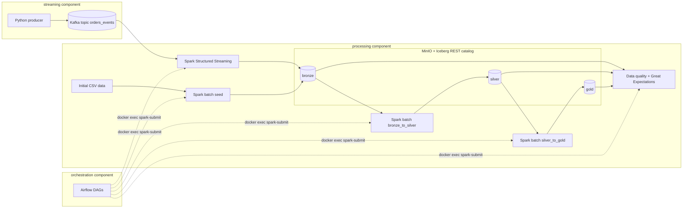

# Project Plan — Data Engineering Final Project

Domain: **e-commerce order analytics** (batch order history + real-time order-status events).
Assumption: the mid-semester project files were not provided, so the dimensional model is
designed fresh for this domain and documented in `docs/data_model.md`. Initial data is
generated (explicitly allowed by the assignment: "Initial data (can be generated)").

## Requirements checklist (from "Data Engineering Final Project.pdf" + "Evaluation criteria.pdf")

Status legend: [ ] pending · [x] DONE (pointer to implementation)

### Required technologies
- [ ] R1. Apache Iceberg table format for all lake tables
- [ ] R2. MinIO (S3-compatible) storage organized in bronze/silver/gold layers
- [ ] R3. Apache Spark for batch processing
- [ ] R4. Apache Spark Structured Streaming for stream processing
- [ ] R5. Apache Kafka as real-time data source
- [ ] R6. Python producer generating Kafka messages
- [ ] R7. Apache Airflow scheduling the ETL pipelines
- [ ] R8. Data models defined with mermaid.js
- [ ] R9. Basic data quality checks implemented
- [ ] R10. Full documentation + setup instructions, easy to run locally with Docker
- [ ] R11. Forbidden tech NOT used: no Hive, no HDFS, no unlearned technologies

### Project structure
- [ ] S1. `/orchestration` — Airflow components
- [ ] S2. `/streaming` — Kafka and producers
- [ ] S3. `/processing` — Spark applications
- [ ] S4. `README.md` at root — how to start the project locally
- [ ] S5. `docs/` — project documentation
- [ ] S6. Three separate Docker Compose files (one per component)
- [ ] S7. Components communicate via a shared Docker network
- [ ] S8. Spark applications run ONLY on processing containers (disqualification rule)

### Implementation requirements
- [ ] I1. Batch data source: at least one dataset loaded into Iceberg tables
- [ ] I2. Streaming data source: real-time stream through Kafka
- [ ] I3. Late-arriving data: handle events arriving out of order up to 48h after event time
- [ ] I4. Batch ETL jobs transforming bronze → silver → gold
- [ ] I5. Stream processing: real-time processing of Kafka messages
- [ ] I6. Data quality validation checks at multiple pipeline stages
- [ ] I7. Fact and dimension tables properly implemented
- [ ] I8. At least one Type 2 SCD
- [ ] I9. Airflow DAGs scheduling both batch and streaming jobs
- [ ] I10. Proper dependencies between DAG tasks
- [ ] I11. Error handling and alerting in orchestration

### Submission / documentation
- [ ] D1. README with setup instructions
- [ ] D2. Architecture diagrams (mermaid)
- [ ] D3. Data model documentation (bronze, silver, gold)
- [ ] D4. Component descriptions
- [ ] D5. Data quality checks documented (must)
- [ ] D6. Initial data (generated) committed so pipelines can start
- [ ] D7. GitHub repo with distributed commits, feature branch workflow (user action at push time)
- [ ] D8. Presentation video, 10 min (USER ACTION — cannot be automated)
- [ ] D9. Demo video end-to-end without cuts (USER ACTION — cannot be automated)

### Bonus
- [ ] B1. Great Expectations data quality checks (implemented)
- [ ] B2. DataHub lineage (SKIPPED — deliberately; heavy multi-service stack that risks the
      "must run simply on grader's machine" requirement; decision documented in README)

## Architecture

## Requirement → component mapping

| Req | Fulfilled by |
|-----|--------------|
| R1, R2 | `processing/docker-compose.yml` (MinIO + Iceberg REST catalog), namespaces `bronze/silver/gold` created in `processing/jobs/seed_bronze.py` |
| R3, I4 | `processing/jobs/seed_bronze.py`, `bronze_to_silver.py`, `silver_to_gold.py` |
| R4, I5 | `processing/jobs/streaming_ingest.py` |
| R5, R6, I2 | `streaming/docker-compose.yml`, `streaming/producer/producer.py` |
| R7, I9–I11 | `orchestration/dags/batch_etl_dag.py`, `streaming_dag.py` |
| R8, D2, D3 | `docs/data_model.md`, `docs/architecture.md` (mermaid) |
| R9, I6, D5 | `processing/jobs/data_quality.py`, `docs/data_quality.md` |
| I1 | Generated CSVs in `processing/data/` loaded to `bronze.*` by `seed_bronze.py` |
| I3 | `bronze_to_silver.py` — 48h lateness rule, quarantine table `silver.order_events_rejected` |
| I7, I8 | `silver_to_gold.py` — `gold.dim_customer` (SCD2), `gold.dim_product`, `gold.dim_date`, `gold.fact_orders`, `gold.daily_sales` |
| S1–S8 | Folder layout + three compose files + shared external docker network `lakehouse`; Spark runs only in `spark-master` (processing) — Airflow triggers via `docker exec` |
| B1 | `processing/jobs/ge_quality.py` (Great Expectations 0.18) |
