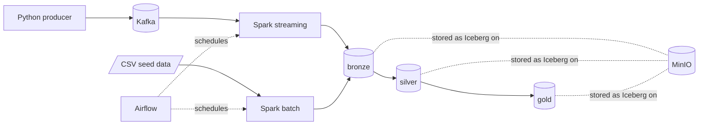

# E-commerce Lakehouse — Data Engineering Final Project

End-to-end pipeline: order history (batch CSV) and real-time order events (Kafka)
land in an Iceberg lakehouse on MinIO, get refined bronze → silver → gold by Spark,
orchestrated by Airflow, with data quality gates at every stage.



More detail: [architecture](docs/architecture.md) · [data model](docs/data_model.md) ·
[data quality](docs/data_quality.md) · [components](docs/components.md)

## Prerequisites

- Docker Desktop (Compose v2), ~6 GB RAM free for containers
- ports free: 8090 (Airflow), 9000/9001 (MinIO), 8181 (catalog), 29092 (Kafka), 4040 (Spark UI)

## Quick start

```bash
# 1. shared network (components talk across compose projects)
docker network create lakehouse

# 2. lakehouse + Spark
docker compose -f processing/docker-compose.yml up -d --build

# 3. Kafka + producer (events start flowing immediately)
docker compose -f streaming/docker-compose.yml up -d --build

# 4. Airflow
docker compose -f orchestration/docker-compose.yml up -d --build
```

Then open Airflow at http://localhost:8090 (admin / admin) and enable both DAGs:

1. `streaming_supervisor` — starts the Kafka → bronze streaming job (runs every 10 min,
   keeps it alive)
2. `batch_etl` — full bronze → silver → gold run with DQ gates (hourly; trigger it
   manually for an immediate run)

## Seeing it work

Watch events flow:

```bash
docker logs -f order-events-producer            # events being produced
docker exec spark-master tail -f /tmp/streaming_ingest.log   # streaming ingestion
```

Inspect the Iceberg tables (before/after each stage):

```bash
docker exec spark-master spark-submit /opt/spark/jobs/show_tables.py bronze
docker exec spark-master spark-submit /opt/spark/jobs/show_tables.py silver
docker exec spark-master spark-submit /opt/spark/jobs/show_tables.py gold
docker exec spark-master spark-submit /opt/spark/jobs/show_tables.py audit
```

MinIO console: http://localhost:9001 (admin / password) — the bronze/silver/gold
data files live under the `warehouse` bucket.

### SCD2 demo

Trigger `batch_etl` in Airflow with config `{"snapshot": "day2"}` (Trigger DAG w/ config).
Day 2 contains ~40 customers who moved city or changed segment; after the run,
`gold.dim_customer` shows closed old versions (`is_current = false`, `effective_to` set)
next to their new current versions:

```bash
docker exec spark-master spark-submit /opt/spark/jobs/show_tables.py gold
```

### Late-arriving data demo

The producer intentionally emits ~15% events 1–47h old (accepted, merged out of
order) and ~5% events older than 48h (quarantined). After a `batch_etl` run check
`silver.order_events_rejected` — every row there breached the 48h rule.

## Initial data

`processing/data/*.csv` is committed so the pipeline starts without any manual step.
The files are generated deterministically; regenerate with:

```bash
python processing/jobs/generate_initial_data.py processing/data
```

`orders.csv` intentionally contains a few bad rows (negative quantity, missing
customer, duplicate id) so the DQ reports have something to show — see
[docs/data_quality.md](docs/data_quality.md).

## Shutdown

```bash
docker compose -f orchestration/docker-compose.yml down
docker compose -f streaming/docker-compose.yml down
docker compose -f processing/docker-compose.yml down
docker network rm lakehouse
# add -v to the down commands to also wipe data volumes
```

## Notes

- Spark applications run only inside the `spark-master` container (processing
  component); Airflow submits jobs via `docker exec`.
- No Hive, no HDFS: Iceberg REST catalog + MinIO object storage.
- Bonus implemented: Great Expectations validation (`ge_quality.py`, last task of
  `batch_etl`). DataHub was considered and skipped deliberately: its multi-service
  stack (Kafka, Elasticsearch, MySQL, GMS) would triple the local footprint and works
  against the "simple to run on the grader's machine" requirement.
