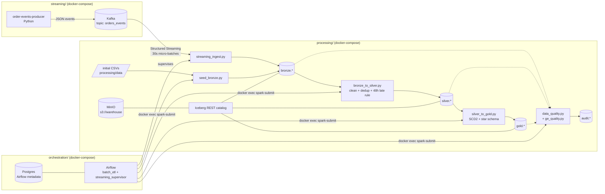

# Architecture

Three isolated components, each with its own Docker Compose file, communicating
over one shared Docker network (`lakehouse`).

## Data flow

1. **Batch path**: generated CSVs (customers, products, 60 days of orders) are loaded
   into `bronze.*` Iceberg tables by `seed_bronze.py` (idempotent MERGE/overwrite).
2. **Streaming path**: the Python producer emits order lifecycle events to Kafka;
   Spark Structured Streaming appends them to `bronze.order_events` with
   exactly-once semantics (checkpointed).
3. **bronze → silver**: cleaning, type conformance, deduplication; the 48h
   late-arrival rule accepts late events into `silver.order_events` / merges them
   into `silver.orders`, and quarantines very late events in
   `silver.order_events_rejected`.
4. **silver → gold**: star schema build — SCD2 customer dimension, product and date
   dimensions, order fact with SCD2-aware surrogate key resolution, daily sales mart.
5. **Data quality** gates run after every stage (bronze, silver, gold) and write an
   audit trail; a failed ERROR-level check blocks the downstream stage.

## Key decisions

- **Iceberg REST catalog + MinIO**: no Hive metastore, no HDFS (both forbidden).
  All table metadata goes through the REST catalog, data files live in
  `s3://warehouse/` on MinIO.
- **Spark runs only in the processing component**: Airflow uses `docker exec` against
  the `spark-master` container to submit every job, so Spark drivers/executors never
  run on orchestration containers (grading disqualification rule).
- **Shared external network**: each compose file joins the pre-created `lakehouse`
  network, keeping the components independently deployable but able to communicate
  by container name (`kafka`, `minio`, `iceberg-rest`, `spark-master`).
- **Idempotent jobs**: every batch job can be re-run safely (MERGE on business keys,
  snapshot-scoped deletes, full rebuilds for derived gold tables), which is what makes
  hourly scheduling and task retries safe.
