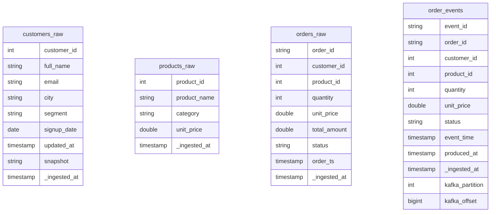
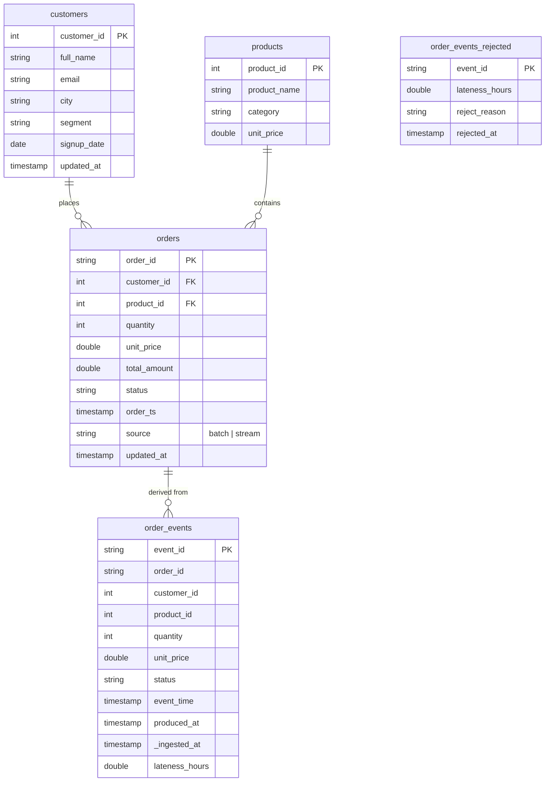
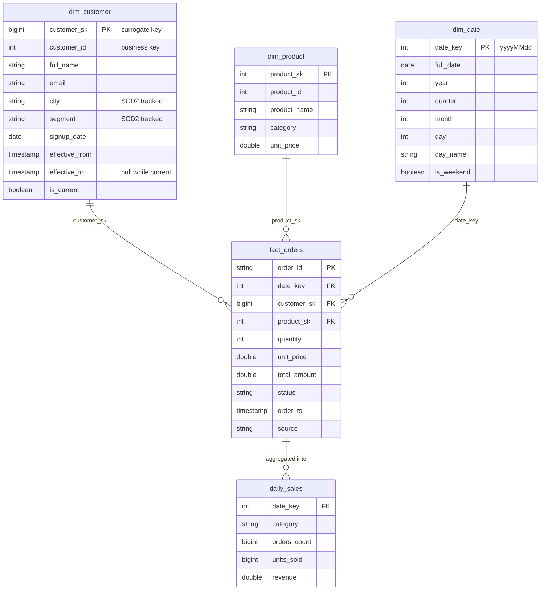

# Data Model

Domain: e-commerce orders. Two sources feed the lake — a batch order history
(CSV snapshots) and a real-time order-event stream (Kafka). The model follows the
medallion architecture: bronze keeps raw data, silver keeps cleaned and conformed
entities, gold is a star schema for analytics.

## Bronze — raw ingested data

Bronze is append-only and unvalidated: dirty rows (nulls, duplicates, negative
amounts) stay here on purpose and are reported by the bronze DQ checks.
`order_events` is partitioned by `days(event_time)`.

## Silver — cleaned and conformed

Silver rules:
- deduplicated on business keys (`order_id`, `event_id`, `customer_id`, `product_id`)
- invalid rows removed (null keys, `quantity <= 0`, `total_amount < 0`)
- **late-arrival rule**: events ingested more than 48h after `event_time` go to
  `order_events_rejected` with a reason; events up to 48h late are merged into
  `orders` out of order (MERGE by `order_id`, latest `event_time` wins)

## Gold — star schema

Design notes:
- `dim_customer` is a **Type 2 SCD**: a change in any tracked attribute closes the
  current row (`is_current = false`, `effective_to` set) and opens a new version with
  a new surrogate key. Facts join on the version whose validity window covers the
  order timestamp, so historical orders keep pointing at the historical attributes.
- `dim_product` is Type 1 (overwrite); its surrogate key equals the business key,
  which is acceptable for a no-history dimension and documented here explicitly.
- `fact_orders` grain: one row per order. `daily_sales` grain: date x category,
  completed/shipped orders only.

## Audit

`audit.dq_results` (native checks) and `audit.ge_results` (Great Expectations)
record every validation run: timestamp, stage/table, check name, violations, passed.
